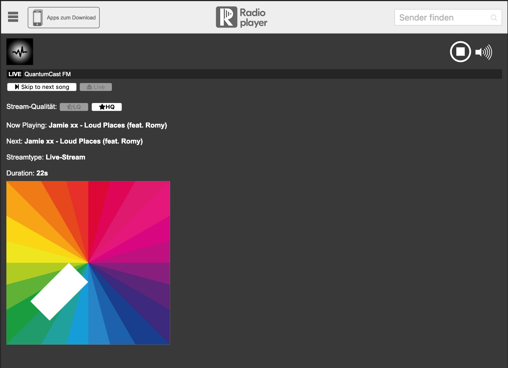

# skiponradio-radioplayer

Reference implementation of streamABC Skip On Radio SDK for Radioplayer.
You can use this as an inspiration on how to use our SDK for your own implementation.

## Usage

- Clone this repository.
- Execute `npm install` in the cloned directory.
- To start this application run `npm run start` in the same directory.
- Point your browser to http://127.0.0.1:8080 to see it in action.

## Description

This is a reference player for Skip On Radio based on a default Radioplayer console.
All code that is neccessary to make Skip On Radio work is inlined in `index.html` in `console` folder.

